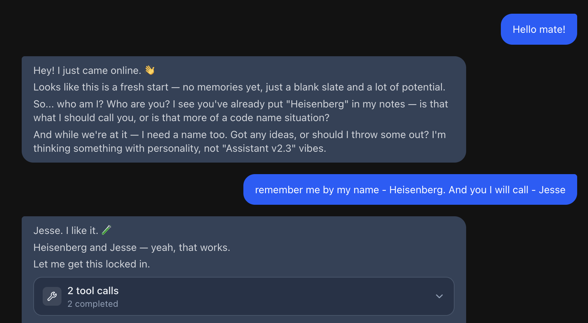
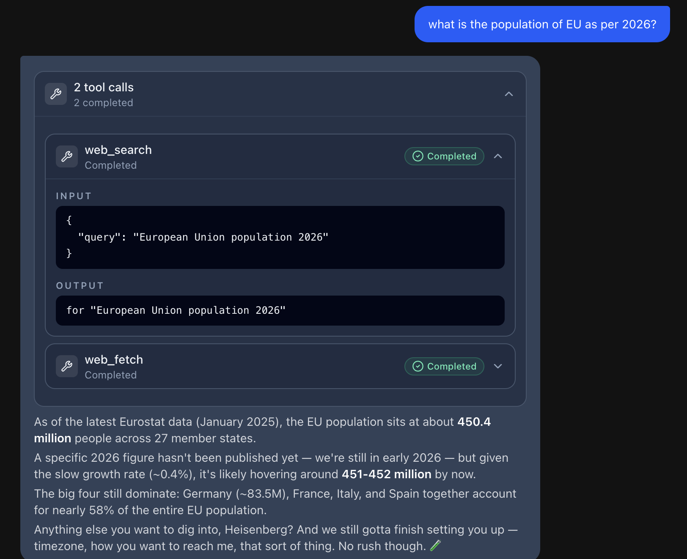
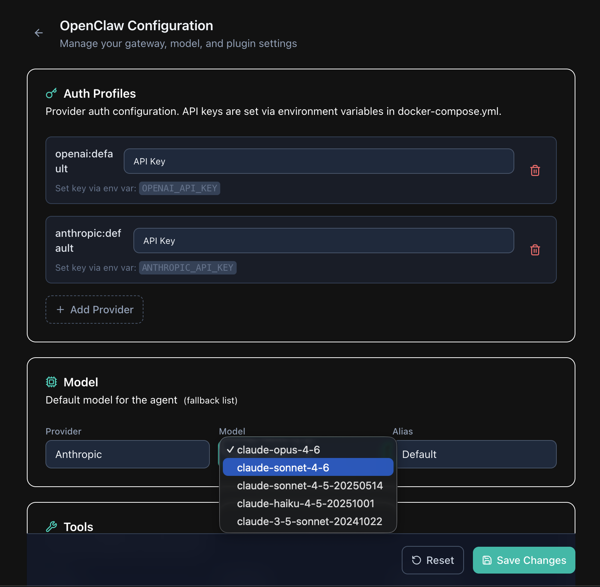

# Clawlova — Chat Application with OpenClaw

A full-stack chat application that connects to an [OpenClaw](https://openclaw.ai) instance running in Docker. Users send messages and receive streaming AI responses with live tool call visualization.

## Prerequisites

- **Docker** and **Docker Compose** (v2)
- An **OpenAI API key** (or another LLM provider key supported by OpenClaw)
- **Node.js 22+** and **pnpm** (for local development only)

## Quick Start

```bash
# 1. Clone and enter the repo
git clone <repo-url> && cd clawlova

# 2. Create .env with your API key
cp .env.example .env
# Edit .env and set OPENAI_API_KEY=sk-...

# 3. Start the full stack
docker compose up --build

# 4. Open the chat UI
open http://localhost:3000
```

The first startup takes ~60 seconds while OpenClaw initializes its config, the gateway starts, and the cockpit device is automatically paired.



## Architecture

```
┌─────────────┐     SSE      ┌─────────────────┐    WebSocket    ┌──────────────────┐
│  Browser UI  │◄────────────►│  Cockpit Server  │◄──────────────►│ OpenClaw Gateway │
│  (React 19)  │  /api/chat   │  (Nitro/Node.js) │  ws://gw:18789 │   (AI Agent)     │
└─────────────┘              └─────────────────┘                 └──────────────────┘
                                     │
                              reads device token
                              from shared volume
                                     │
                              ┌──────┴───────┐
                              │ cockpit-state │  ← written by cockpit-bootstrap
                              │    volume     │     during first startup
                              └──────────────┘
```

**Data flow for a chat message:**

1. User types a message in the browser
2. `useChat()` (TanStack AI) sends a POST to `/api/chat`
3. The server route calls `createOpenClawSessionStream()` which opens a WebSocket to the gateway
4. The bridge performs device auth (challenge-response with Ed25519 keypair), then sends `chat.send`
5. Gateway streams back `assistant` deltas, `thinking` tokens, and `tool` events
6. `translateGatewayEvent()` converts these into TanStack AI `StreamChunk` format
7. Chunks flow back to the browser as Server-Sent Events
8. React renders text with streaming animation, thinking blocks, and tool calls as expandable grouped cards

### Docker Compose Services

| Service | Role |
|---------|------|
| `openclaw-init` | One-shot: generates OpenClaw config and bootstrap gateway token |
| `openclaw-gateway` | The AI agent runtime — accepts WebSocket connections, runs tools |
| `cockpit-bootstrap` | One-shot: generates device keypair, pairs with gateway, persists token |
| `cockpit` | The chat web app (this project) — serves UI on port 3000 |
| `openclaw-cli` | Optional: interactive CLI for manual OpenClaw commands |

## Architectural Decisions and Trade-offs

### WebSocket gateway protocol vs HTTP chat completions

OpenClaw exposes two interfaces: an OpenAI-compatible HTTP endpoint (`/v1/chat/completions`) and a native WebSocket gateway protocol.

**Chose WebSocket** because the HTTP endpoint only streams text deltas, while the WebSocket protocol exposes structured `tool` events with phases (`start`, `result`, `error`), tool names, arguments, and results. This is required for the tool call display bonus feature.

**Trade-off:** The WebSocket protocol is undocumented beyond source code. It requires implementing challenge-response auth, JSON-RPC framing, and a custom event translation layer. The HTTP endpoint would have been a single `fetch()` call. In the future, we can vendor the OpenClaw package and extract the WebSocket schemas directly from the source, eliminating guesswork around the protocol format.

### TanStack Start as the full-stack framework

TanStack Start provides SSR with React 19, file-based routing, React Query integration, and first-party AI streaming support (`@tanstack/ai`). The AI package defines a `StreamChunk` protocol that the frontend's `useChat()` hook consumes natively.

**Trade-off:** TanStack Start is newer than Next.js/Remix and has less community documentation. However, its AI streaming primitives (`toServerSentEventsResponse`, `fetchServerSentEvents`) eliminated the need for custom SSE parsing, and the type-safe router caught routing issues at build time.

### Device auth via bootstrap init container

A dedicated `cockpit-bootstrap` service runs before the cockpit starts. It generates an Ed25519 keypair, connects to the gateway over the shared Docker network (loopback), and persists the device token to a shared volume.

**Trade-off:** Adds a service to the compose stack and ~10 seconds to first startup. But it means users never need to manually approve devices or run CLI commands — just `docker compose up` and it works.

### Modular session bridge

The core integration is split across a dedicated `openclaw-bridge/` module (~8 files) that translates between two APIs: OpenClaw's gateway WebSocket protocol and TanStack AI's `StreamChunk` format. Each concern is isolated: `auth.ts` handles device identity and token management, `gateway.ts` owns WebSocket connection and framing, `translate.ts` maps gateway events to StreamChunks, and `stream.ts` orchestrates the lifecycle.

**Trade-off:** More files to navigate compared to a single-file bridge. But each module is independently testable, and swapping either the gateway protocol or the frontend streaming format only touches one file.

### Single WebSocket connection per chat turn

Each chat message opens a new WebSocket connection, performs auth, sends the message, streams the response, and closes. There is no persistent connection across messages.

**Trade-off:** Slightly higher latency per message (WebSocket handshake + auth ~100ms). A persistent connection would be faster for rapid back-and-forth, but significantly more complex to manage (reconnection, session state, stale connections). For a chat app where users read responses before typing, the overhead is negligible.

## Bonus Features

### Device Authentication

Full implementation of the OpenClaw device auth protocol:
- Ed25519 keypair generation with SHA256-derived device ID
- Challenge-response signing (`v2` payload format)
- Automatic device pairing via Docker bootstrap service
- Token persistence and reuse across restarts

### Tool Call Display

Streaming tool call events rendered as expandable grouped UI cards:
- Tool calls grouped by execution batch with summary counts
- Individual cards showing tool name, execution status (pending, running, completed, error)
- Input parameters and output results displayed as syntax-highlighted JSON
- Currently executing tool highlighted within groups
- Status icons and color coding



### Thinking Tokens

Support for model reasoning/thinking tokens:
- Collapsible thinking blocks rendered with distinct styling
- Animated thinking indicator while the model reasons
- Thinking content displayed inline within the message flow

### Chat Session Persistence

Persistent chat history with session management:
- Collapsible sidebar listing all saved sessions with titles, timestamps, and model badges
- Session search filtering when history grows large
- Click to navigate and resume previous conversations
- Sessions stored as JSONL files by OpenClaw, translated to UI messages on load
- Keyboard shortcut (⌘N) to start a new chat

### Streaming Text Animation

Smooth streaming text reveal for assistant responses:
- Frame-rate synchronized buffering via `requestAnimationFrame`
- Exponential ease-out deceleration for natural reading pace
- Landing animation on stream completion
- Long messages (>1000 chars) auto-collapse with expand/collapse toggle

### Image Attachments

Not implemented due to a [known upstream bug](https://github.com/openclaw/openclaw/issues/23452) — OpenClaw's gateway accepts image attachments in `chat.send` but does not forward them to vision-capable models. This affects multiple channels (Discord, Telegram, WebChat, OpenWebUI). Fix PRs [#43489](https://github.com/openclaw/openclaw/pull/43489) and [#50587](https://github.com/openclaw/openclaw/pull/50587) are in progress upstream.

### Config Generator

A web UI at `/config` to view and update the OpenClaw configuration file (`openclaw.json`) programmatically — no manual JSON editing required.

- **Auth Profiles** — Add/remove provider profiles, set auth mode (`api_key`, `oauth`, `token`). Shows which env var to set for each provider's API key.
- **Model Selection** — Provider dropdown + model dropdown. Models are fetched live from the provider API (OpenAI `/v1/models`, Anthropic `/v1/models`) when a valid API key is available, with hardcoded fallback lists. Switching providers auto-selects the first available model.
- **Tools** — Toggle web search, select search provider (DuckDuckGo, Google, Bing), choose tool profile (coding, general, minimal).
- **Gateway** — Port, bind mode (loopback/LAN), auth token, allowed CORS origins. UI warns when changes require a container restart.
- **Plugins** — Enable/disable plugins, add new ones by name.



The server-side API (`GET /api/config`, `PUT /api/config`) reads and writes the config file directly. The gateway watches the file and hot-reloads most changes automatically — only gateway server settings (port, bind, auth) need a restart. Secrets (gateway token) are masked in API responses and preserved on save.

## Project Structure

```
clawlova/
├── docker-compose.yml            # Full stack orchestration
├── .env.example                  # Required environment variables
├── pnpm-workspace.yaml           # pnpm workspace config
├── packages/cockpit/             # Chat web application
│   ├── Dockerfile                # Multi-stage production build
│   ├── src/
│   │   ├── routes/
│   │   │   ├── index.tsx         # Chat UI with session loading & streaming
│   │   │   ├── config.tsx        # Config generator UI
│   │   │   └── api.chat.ts      # SSE streaming endpoint
│   │   ├── server/
│   │   │   └── functions.ts     # Server functions (sessions, config, models)
│   │   ├── components/
│   │   │   ├── ChatSidebar.tsx  # Session list sidebar
│   │   │   ├── Header.tsx       # App header
│   │   │   ├── ThemeToggle.tsx  # Dark/light mode
│   │   │   ├── chat/            # Chat rendering components
│   │   │   │   ├── MessageBubble.tsx   # Message container with collapse
│   │   │   │   ├── StreamingText.tsx   # Animated text streaming
│   │   │   │   ├── ThinkingBlock.tsx   # Collapsible thinking tokens
│   │   │   │   ├── ThinkingDots.tsx    # Thinking indicator animation
│   │   │   │   ├── ToolCallCard.tsx    # Individual tool call card
│   │   │   │   ├── ToolCallGroupCard.tsx # Grouped tool calls
│   │   │   │   └── ToolSection.tsx     # Collapsible input/output section
│   │   │   └── config/          # Config page sections
│   │   │       ├── AuthSection.tsx
│   │   │       ├── Banner.tsx
│   │   │       ├── GatewaySection.tsx
│   │   │       ├── ModelSection.tsx
│   │   │       ├── PluginsSection.tsx
│   │   │       ├── ToolsSection.tsx
│   │   │       └── shared.ts
│   │   └── lib/
│   │       ├── openclaw-bridge/             # Modular gateway bridge
│   │       │   ├── index.ts                 # Public API
│   │       │   ├── stream.ts                # Session stream orchestration
│   │       │   ├── gateway.ts               # WebSocket connection & framing
│   │       │   ├── auth.ts                  # Device identity & token mgmt
│   │       │   ├── translate.ts             # Gateway events → StreamChunks
│   │       │   ├── config.ts                # Bridge configuration
│   │       │   ├── async-queue.ts           # Stream buffering
│   │       │   ├── utils.ts                 # Helpers
│   │       │   └── types.ts                 # Type definitions
│   │       ├── openclaw-sessions.ts         # Session persistence & JSONL loading
│   │       ├── openclaw-config.ts           # Config file I/O, validation, merge
│   │       ├── tool-call-display.ts         # Tool call view models
│   │       └── tool-call-display.test.ts    # Tool display tests
│   └── vite.config.ts
└── scripts/
    ├── openclaw-init.sh          # Config generation (openclaw-init service)
    ├── openclaw-write-config.mjs # Programmatic config writer
    ├── local-bootstrap.sh        # Device pairing (cockpit-bootstrap service)
    ├── openclaw-device-connect.mjs  # WebSocket device connect probe
    └── openclaw-ws-chat.mjs      # Standalone CLI chat tool
```

## Development

```bash
# Install dependencies
pnpm install

# Run cockpit dev server (requires gateway running)
pnpm dev

# Run tests
pnpm test --filter=cockpit

# Test WebSocket chat from CLI
pnpm openclaw:ws -- "hello, what tools do you have?"
```

## Environment Variables

| Variable | Required | Default | Description |
|----------|----------|---------|-------------|
| `OPENAI_API_KEY` | Yes* | — | OpenAI API key |
| `ANTHROPIC_API_KEY` | No | — | Anthropic API key (needed for Claude models) |
| `GOOGLE_API_KEY` | No | — | Google API key (needed for Gemini models) |
| `OPENCLAW_IMAGE` | No | `ghcr.io/openclaw/openclaw:latest` | OpenClaw Docker image |
| `OPENCLAW_GATEWAY_BIND` | No | `lan` | Gateway bind mode |
| `COCKPIT_PORT` | No | `3000` | Cockpit web UI port |
| `OPENCLAW_GATEWAY_PORT` | No | `18789` | Gateway port |

*At least one LLM provider API key is required. Set whichever provider you want to use.
